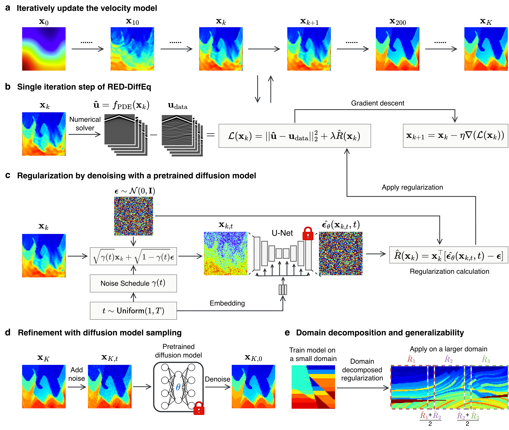

<div align="center">

# RED-DiffEq

**Regularization by Denoising Diffusion Models for Solving Inverse PDE Problems**

[](https://www.python.org/downloads/)
[](https://opensource.org/licenses/MIT)


</div>

## Method Overview

<p align="center">
  
</p>

## Quick Start (Terminal)

Run all commands from the repository root.

### 1. Environment setup

```bash
python -m venv .venv
source .venv/bin/activate
pip install --upgrade pip
pip install -r requirements.txt
```

### 2. Check required pretrained model

```bash
ls -lh pretrained_models/model-4.pt
```

### 3. Run a quick OpenFWI example (single sample)

This uses the mini example dataset included in this repository.

```bash
python scripts/run_inversion.py \
  --config example/example_config/red-diffeq_openfwi.yaml \
  --sample_index 0 \
  --experiment_name example_openfwi_terminal
```

### 4. Run a quick Marmousi example

```bash
python scripts/run_inversion.py \
  --config example/example_config/red-diffeq_marmousi.yaml \
  --experiment_name example_marmousi_terminal
```

## Full Dataset Runs

Use the configs in `configs/` for full experiments:

```bash
python scripts/run_inversion.py --config configs/openfwi/red-diffeq.yaml
python scripts/run_inversion.py --config configs/marmousi/red-diffeq.yaml
python scripts/run_inversion.py --config configs/overthrust/red-diffeq.yaml
```

TV and Tikhonov baselines:

```bash
python scripts/run_inversion.py --config configs/marmousi/tv.yaml
python scripts/run_inversion.py --config configs/marmousi/tikhonov.yaml
python scripts/run_inversion.py --config configs/overthrust/tv.yaml
python scripts/run_inversion.py --config configs/overthrust/tikhonov.yaml
```

## Output

Each run writes results to the `experiment.results_dir` path set in the config, under:

```text
<results_dir>/<dataset_name>/<experiment_name>/<timestamp>/<family_name>/
```

Each `*_results.npz` typically contains:

- `result`
- `initial_velocity`
- `ground_truth`
- `total_losses`
- `obs_losses`
- `reg_losses`
- `ssim`
- `mae`
- `rmse`

## Data

Official data-source links and placement instructions are documented in:

- `dataset/README.md`
- `dataset/OpenFWI/README.md`
- `dataset/Marmousi/README.md`
- `dataset/Overthrust/README.md`

## Notes

- Primary entry point: `scripts/run_inversion.py`
- Current maintained diffusion checkpoint: `pretrained_models/model-4.pt`
- For reproducibility, set `experiment.random_seed` in your config.

## License

This project is licensed under the MIT License. See [LICENSE](LICENSE).

## Acknowledgments

- Diffusion model implementation based on [denoising-diffusion-pytorch](https://github.com/lucidrains/denoising-diffusion-pytorch)
- OpenFWI dataset
